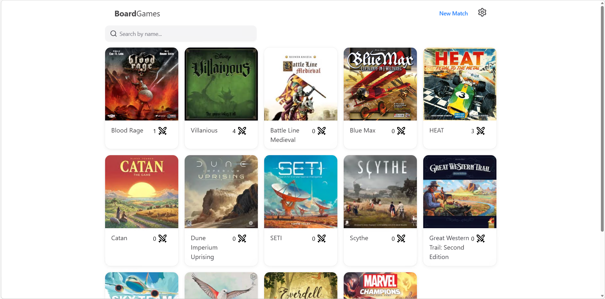
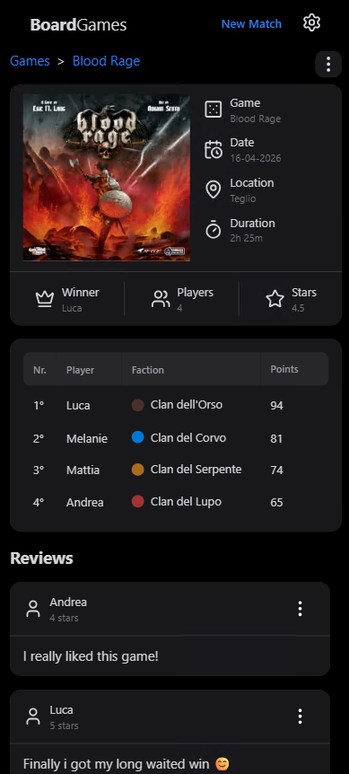
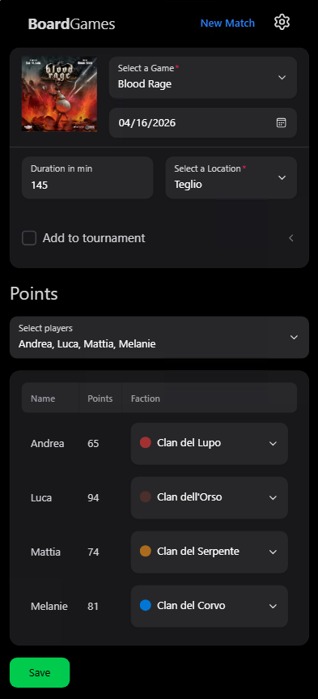
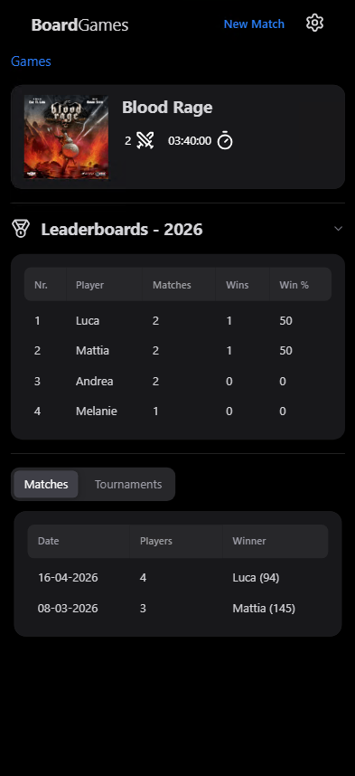
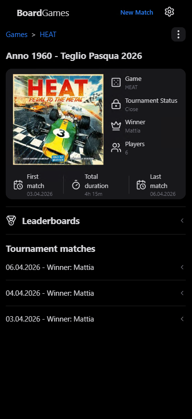

  <h1 align="center">
      BoardGames
  </h1>

<p align="center">
  <p align="center">A selfhosted board game tracker<br>
  </p>
</p>




<details>
<summary>More screenshots</summary>

<p align="center">
  
  
  
  
</p>

</details>

## What is it
It's a very simple application that lets you register your game matches.
It's written in C# using Blazor in .NET 10 with the beaufiful [LumexUI](https://lumexui.org/). 

The database is SQLLite.

## Why
I really enjoy playing board games with my dad and my brother, in some games you find already a small paper where you can write who won each match but since i like coding, i like c# and i like analitics i decided to have some fun and develop something for us.


For me it's a way of learning git, learning more about Blazor and it's capabilities

## Features
- **Dark mode**: it just couldn't miss this one
- **Phone UI**: The application UI is developed with the Phone UI as first in mind
- **Record your matches**: Well ofc with this app you are able to register a match with some basic metadata like date, duration and a location where the game took place
- **Tournament**: You can create a tournament which is basically grouping multiple matches of the same game together
- **Share**: You can easily share a match or a tournament and the meta will create the post for you
- **Reviews**: You can add a review of a match
- **Use of factions**: You are able to register a game and it's faction, you can than later select them while giving points as well
- **Settings PIN**: Set a Pin to lock users from messing with the data
- **Multilanguage**: At the moment the application support English, Italian, German and French

## Deploy - Docker Compose
the easiet way is with docker compose

```yaml
---
services:
  boardgames:
    image: ghcr.io/andymcmars/boardgames:latest
    container_name: boardgames_net
    ports:
      - "8080:8080"
    environment:
      - TZ=Europe/Rome
      - PIN_LOCK=4567
    volumes:
      - myvolume/boardgames/db:/app/Data
      - myvolume/boardgames/keys:/app/Keys
    restart: unless-stopped
```

## Future plans
- User Login as a requirment with possible shared password
- User statistics page
- Email users once a match is created
